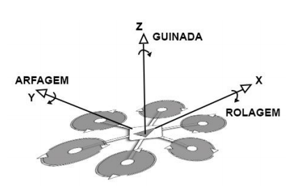
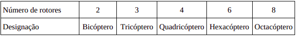
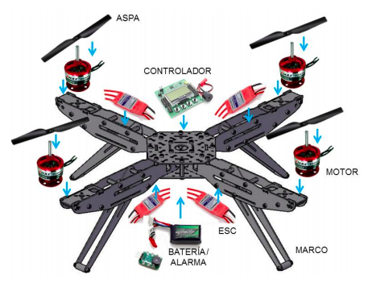
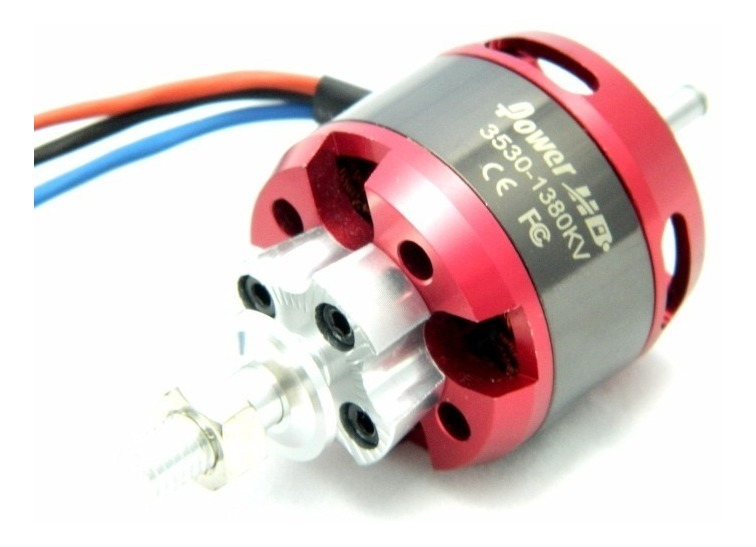
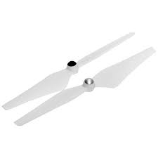
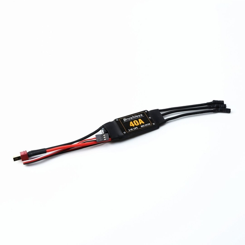
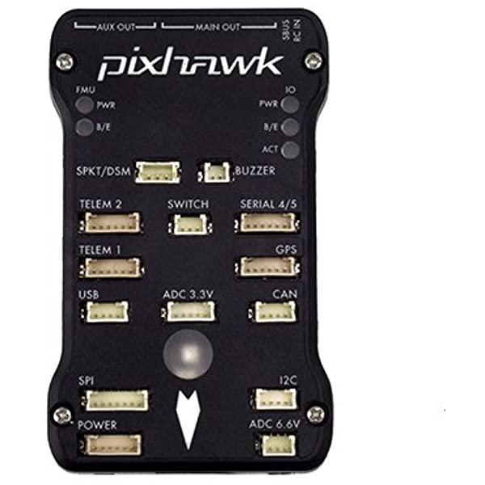
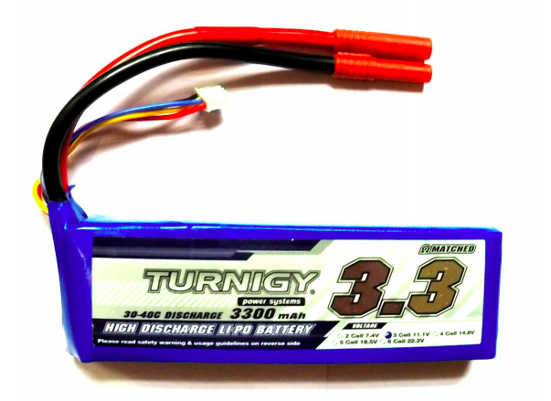
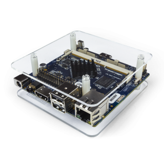

# Aula introdutória aos Elementos Básicos de um drone e suas aplicações.

## O que é um drone afinal?
**Drone** é um veículo aéreo não tripulado e controlado remotamente que pode realizar inúmeras tarefas. Atualmente as maiores áreas de aplicação de um multirotor são de cinematografia e de
vigilância. As tarefas possíveis incluem levantamento de terreno de um edifício, patrulha, fotografia e filmagem de eventos, cada um tendo requisitos específicos de projeto.

## Por que o foco em drones na diciplina?
O foco nessa tecnologia se deve a complexidade dela frente a utilização de microcontroladores e de sistemas embarcados, visto a alta mobilidade do drone (6 graus de liberdade) e consequente dificuldade no controle.

## Estrutura e Componentes de um multicoptero

Um multicopero é um veículo aéreo que controla seu movimento através da
aceleração ou desaceleração dos múltiplos motores e hélices. São basicamente diferenciados em relação ao número de rotores.

A estrutura básica do corpo do drone é formada por uma região central onde se acoplam os braços e onde ficam fixados os sensores, o controlador de voo e as baterias, nas extremidades dos braços são acoplados os motores.

Dentre os principais componentes desses tipos de drones:

* Motores 
* Controlador Eletronico de Velocidade (ESC)
* Hélices
* Microcontrolador
* Antena
* Bateria
* Diferentes sensores, dependendo da aplicação desejada
* Frame

Ainda assim, podemos incluir também um computador de bordo, que diferencia um drone offboard de um drone onboard. Veremos isso com mais detalhes para frente.

### Motores

Apesar de haver bastante divergência entre as classificações de motores pelo autores da área, os dois tipos principais de motores elétricos são os motores com escovas e os sem escovas (“brushless”). Para as utilizações em drones, que requeremaltas rotações e potências relativamente altas, os motores de indução (brushless) são amplamente usados por sua eficiência e durabilidade.

### Hélices

As hélices de um drone multirotor são os componentes que trabalham sob as mais severas condições. Sob as hélices atuam: O torque dos motores e a força de arrasto aerodinâmico da propulsão do ar. As hélices ainda sofrem acelerações e desacelerações rápidas para manter a estabilidade do voo do drone, por esses motivos, elas precisam ser componentes resistentes e duráveis, sem, contudo, serem caras, pois são, também, componentes com alto índice de quebra em acidentes.

### Eletronic Speed Controler (ESC)

Um controle eletrônico de velocidade, ou “ESC” é um componente que controla a velocidade de um motor eletrônico por meio de uma tecnologia conhecida como modulação por largura de pulso (MLP), mais conhecida pela sigla em inglês “PWM” (Pulse-Width Modulation), e envolve a modulação de sua razão cíclica para transportar qualquer tipo de informação sobre uma via de comunicação ou para controlar a disponibilidade de alimentação entregue a carga. Resumidamente, o papel dos ESCs no drone são controlar a velocidade dos motores.

### Microcontrolador

A principal função de um sistema de controle de voo (FCS - Flight Control System) é contribuir para a operação segura e econômica da aeronave, já que, em um multirotor, a dinâmica de voo pode ser bastante complexa e a sua operação em um modo totalmente manual é impraticável. Isto se dá devido às inúmeras variáveis envolvidas como, diferenças entre os motores, desbalanceamento de hélices, vento, turbulências, vibrações mecânicas e até mesmo falhas elétricas e mecânicas. Neste sentido, o advento dos multirotores só foi possível com o avanço das tecnologias de sistemas embarcados.

### Baterias

Como visto anteriormente, na seção de motores e controladores de
velocidade, um drone é um dispositivo que opera com correntes altas, neste sentido há uma grande exigência das baterias que fornecem energia para tal.
As principais características de uma bateria que se deve levar em consideração, no momento do projeto de um drone, são: Carga, taxa de descarga, número de células e peso. 

### Sensores

Além dos principáis componentes de um drone, a aeronave pode contar com outros dispositivos que podem ser: 
* Sensores auxiliadores do voo
* Sensores para reconhecimento/mapeamento do ambiente
* Câmeras 
* Iluminação
* Transmissores de vídeo em tempo real
* Praticamente qualquer carga que não exceda as limitações de peso da aeronave.

### Computador de Bordo

Em um drone offboard, as missiões são recebidas a partir de um computador externo e o processamento de informaçoes recebidas a partir de sensores não ocorrere no drone. Isso gera um certo grau de dependencia de processamento externo para a tomada de decisões do drone, no qual requer uma alta tranmissão de informações que em certos cenários é inviável.

Portanto, ao implementar um computador de bordo ao drone, tornando-o onboard, as informações são mais facilmente processadas, o que torna a tomada de decisões mais rápida. Isso viabiliza a implementação de visão computacional no drone por exemplo.

## Software do Drone

### Robot Operating System (ROS)
Para o controle do drone, existem muitas formas de realizar essa tarefa, porém, o foco da diciplina será a utilização da plataforma ROS. Resumidamente, ROS é uma coleção de frameworks de software para o desenvolvimeto de robos, incluindo drones, que centralizam a obtenção de informaçoes adiquiridas pelo drone e as envia para seus respectivos destinos onde irão ser processadas.
Mais detalhes desse software serão discutidos proxima aula.