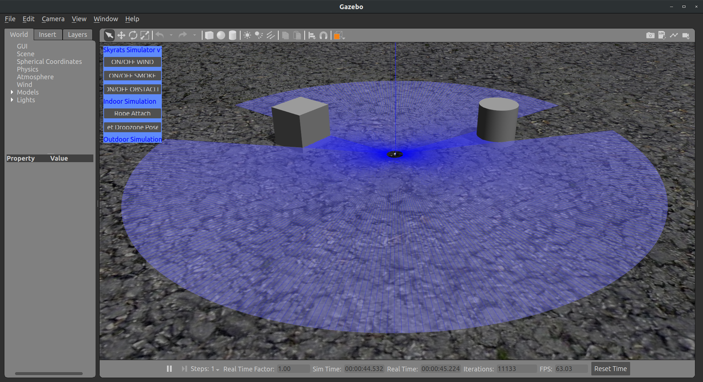

# Aula 5 - Gazebo e Sensores

Nesta atividade, vamos explorar o ambiente de simulação utilizado, o Gazebo, e a utilização de sensores em sistemas embarcados.

> Todos os modelos apresentados nessa aula já estão presentes na instalação da PX4. O código em Python ao final está presente no pacote `mav_control`.

## 1. Gazebo

O [Gazebo](http://gazebosim.org/) é um simulador Open Source amplamente utilizado em robótica. 

### 1.1. Models

**Exemplo: Asphalt plane**

```xml
<?xml version="1.0" ?>
<sdf version="1.5">
  <model name="asphalt_plane">
    <static>true</static>
    <link name="link">
      <collision name="collision">
        <geometry>
          <box>
            <size>200 200 .1</size>
          </box>
        </geometry>
      </collision>
      <visual name="visual">
        <cast_shadows>false</cast_shadows>
        <geometry>
          <box>
            <size>200 200 .1</size>
          </box>
        </geometry>
        <material>
          <script>
            <uri>model://asphalt_plane/materials/scripts</uri>
            <uri>model://asphalt_plane/materials/textures</uri>
            <name>vrc/asphalt</name>
          </script>
        </material>
      </visual>
    </link>
  </model>
</sdf>
```

### Exemplo: empty.world

```xml
<?xml version="1.0" ?>
<sdf version="1.5">
  <world name="default">
    <!-- A global light source -->
    <include>
      <uri>model://sun</uri>
    </include>
    <!-- A ground plane -->
    <include>
      <uri>model://ground_plane</uri>
    </include>
    <include>
      <uri>model://asphalt_plane</uri>
    </include>
    <physics name='default_physics' default='0' type='ode'>
      <gravity>0 0 -9.8066</gravity>
      <ode>
        <solver>
          <type>quick</type>
          <iters>10</iters>
          <sor>1.3</sor>
          <use_dynamic_moi_rescaling>0</use_dynamic_moi_rescaling>
        </solver>
        <constraints>
          <cfm>0</cfm>
          <erp>0.2</erp>
          <contact_max_correcting_vel>100</contact_max_correcting_vel>
          <contact_surface_layer>0.001</contact_surface_layer>
        </constraints>
      </ode>
      <max_step_size>0.004</max_step_size>
      <real_time_factor>1</real_time_factor>
      <real_time_update_rate>250</real_time_update_rate>
      <magnetic_field>6.0e-6 2.3e-5 -4.2e-5</magnetic_field>
    </physics>
  </world>
</sdf>
```

## 2. Sensores

Um sensor é um dispositivo capaz de medir uma grandeza física. Assim, eles fornecem aos sistemas embarcados informações sobre o ambiente no qual estão inseridos, permitindo a resposta a estímulos externos. 


Em drones, sensores são essenciais para a localização e a navegação, bem como para tarefas de percepção externa. Alguns sensores frequentemente usados são

- **IMU**: A unidade de medição inercial (*Inertial Measurement Unit*) é um dispositivo responsável por medir a aceleração, a velocidade angular e a orientação do sistema. Ele geralmente é composto por giroscópios, acelerômetros e magnetômetros. Através da IMU, é possível estimar a posição do drone em relação a um referencial local.
- **GPS**: O GPS é um sensor que utiliza uma rede de satélites para calcular a posição do drone em relação a um referencial global (latitude, longitude e altitude).
- **LIDAR**: O LiDAR (*Light Detection And Ranging*) é um tipo de sensor que utiliza o tempo de ida e volta de ondas eletromagnéticas para calcular distâncias. Dependendo de sua orientação relativa ao drone, ele pode medir altitude ou distância em relação a outros objetos.
- **Câmera**: Frequentemente câmeras são embarcadas em drones, possibilitando que eles registrem fotos e vídeos, além de detectar objetos e responder a estímulos em tempo real.

No exemplo a seguir, vamos explorar como implementar no Gazebo sensores que repliquem o seu funcionamento no mundo real. 

### Exemplo: Drone com LIDAR 360

O código abaixo (localizado em `~/src/Firmware/Tools/sitl_gazebo/models/rplidar/model.sdf`) é o modelo no Gazebo de um LIDAR 360 da marca RPLIDAR, ou seja, é um sensor capaz de medir distâncias ao redor dele em um campo de visão de 360°.

```xml
<?xml version="1.0" ?>
<sdf version="1.5">
  <model name="rplidar">
    <link name="link">

      <inertial>
        <pose>0 0 0 0 0 0</pose>
        <mass>0.19</mass>
        <inertia>
          <ixx>4.15e-6</ixx>
          <ixy>0</ixy>
          <ixz>0</ixz>
          <iyy>2.407e-6</iyy>
          <iyz>0</iyz>
          <izz>2.407e-6</izz>
        </inertia>
      </inertial>

      <visual name="visual">
        <geometry>
          <box>
            <size>0.02 0.05 0.05</size>
          </box>
        </geometry>
      </visual>

      <sensor name="laser" type="gpu_ray">
        <ray>
          <scan>
            <horizontal>
              <samples>360</samples>
              <resolution>1</resolution>
              <min_angle>-3.14</min_angle>
              <max_angle>3.14</max_angle>
            </horizontal>
          </scan>
          <range>
            <min>0.2</min>
            <max>6</max>
            <resolution>0.05</resolution>
          </range>
          <noise>
            <type>gaussian</type>
            <mean>0.0</mean>
            <stddev>0.01</stddev>
          </noise>
        </ray>
        <plugin name="laser" filename="libGpuRayPlugin.so" />
        <plugin name="gazebo_ros_head_rplidar_controller" filename="libgazebo_ros_gpu_laser.so">
          <topicName>laser/scan</topicName>
          <frameName>rplidar_link</frameName>
        </plugin>
        <always_on>1</always_on>
        <update_rate>5.5</update_rate>
        <visualize>true</visualize>
      </sensor>
    </link>
  </model>
</sdf>
```

Vamos agora analisar cada trecho

```xml
<?xml version="1.0" ?>
<sdf version="1.5">
  <model name="rplidar">
    <link name="link">

      <inertial>
        <pose>0 0 0 0 0 0</pose>
        <mass>0.19</mass>
        <inertia>
          <ixx>4.15e-6</ixx>
          <ixy>0</ixy>
          <ixz>0</ixz>
          <iyy>2.407e-6</iyy>
          <iyz>0</iyz>
          <izz>2.407e-6</izz>
        </inertia>
      </inertial>

      <visual name="visual">
        <geometry>
          <box>
            <size>0.02 0.05 0.05</size>
          </box>
        </geometry>
      </visual>
      ...
    </link>
  </model>
</sdf>
```

O início do arquivo é igual a qualquer outro modelo: defini-se seu nome e suas propriedades visuais, de inércia e de colisão. As proriedades de inércia foram medidas no objeto real, e sua visualização foi simplificada para uma caixa. A geometria de colisão não é configurada para esse sensor, visto que ele dificilmente entrará em contato com algum modelo externo. 

```xml
      <sensor name="laser" type="gpu_ray">
        <ray>
          <scan>
            <horizontal>
              <samples>360</samples>
              <resolution>1</resolution>
              <min_angle>-3.14</min_angle>
              <max_angle>3.14</max_angle>
            </horizontal>
          </scan>
          <range>
            <min>0.2</min>
            <max>6</max>
            <resolution>0.05</resolution>
          </range>
          <noise>
            <type>gaussian</type>
            <mean>0.0</mean>
            <stddev>0.01</stddev>
          </noise>
        </ray>
        ...
        <always_on>1</always_on>
        <update_rate>5.5</update_rate>
        <visualize>true</visualize>
      </sensor>
```

A tag `sensor` indica ao Gazebo que esse modelo é um sensor, neste caso do tipo `laser`. Dentro dessa tag, são configuradas as especifidades do sensor, como resolução, ângulo de visão e até mesmo ruído.

```xml
      <sensor name="laser" type="gpu_ray">
        ...
        <plugin name="laser" filename="libGpuRayPlugin.so" />
        <plugin name="gazebo_ros_head_rplidar_controller" filename="libgazebo_ros_gpu_laser.so">
          <topicName>laser/scan</topicName>
          <frameName>rplidar_link</frameName>
        </plugin>
        ...
      </sensor>
```

Finalmente, o trecho acima configura alguns plugins necessários para fazer a interface do LIDAR com o ROS.

Assim, esse modelo representa não somente o funcionamento do sensor mas também sua geometria e suas propriedades físicas. Uma vez determinado isso, basta incluir esse modelo no sistema em que deseja utilizá-lo.

Nesse caso, vamos adicionar o RPLIDAR no Iris, o drone que estávamos usando nas últimas aulas. O código abaixo mostra o modelo de um Iris com um LIDAR 360, um LIDAR unidirecional e um Optical Flow, e se encontra em `~/src/Firmware/Tools/sitl_gazebo/models/iris_rplidar/iris_rplidar.sdf`.


```xml
<?xml version="1.0" ?>
<sdf version='1.5'>
  <model name='iris_rplidar'>

    <include>
      <uri>model://iris</uri>
    </include>

    <include>
      <uri>model://rplidar</uri>
      <pose>0 0 0.1 0 0 0</pose>
    </include>
    <joint name="rplidar_joint" type="revolute">
      <child>rplidar::link</child>
      <parent>iris::base_link</parent>
      <axis>
        <xyz>0 0 1</xyz>
        <limit>
          <upper>0</upper>
          <lower>0</lower>
        </limit>
      </axis>
    </joint>

    <include>
      <uri>model://lidar</uri>
      <pose>-0.12 0 0 0 3.1415 0</pose>
    </include>
    <joint name="lidar_joint" type="fixed">
      <child>lidar::link</child>
      <parent>iris::base_link</parent>
      <axis>
        <xyz>0 0 1</xyz>
        <limit>
          <upper>0</upper>
          <lower>0</lower>
        </limit>
      </axis>
    </joint>

    <include>
      <uri>model://flow_cam</uri>
      <pose>-0.12 0.05 0 0 1.5708 1.5708</pose>
    </include>
    <joint name="flow_joint" type="revolute">
      <child>camera::link</child>
      <parent>iris::base_link</parent>
      <axis>
        <xyz>0 0 1</xyz>
        <limit>
          <upper>0</upper>
          <lower>0</lower>
        </limit>
      </axis>
    </joint>

  </model>
</sdf>
```

Note que o modelo `iris_rplidar` é composto por diversos submodelos, correspondendo ao drone (`iris`) e a cada um dos sensores (`rplidar`, `lidar` e `flow_cam`). A inclusão de arquivos de modelos externos é feita com a tag `include`.

Além disso, é necessário especificar como o sensor se movimenta (ou não) em relação ao drone, utilizando *joints*.

```xml
    <include>
      <uri>model://rplidar</uri>
      <pose>0 0 0.1 0 0 0</pose>
    </include>
    <joint name="rplidar_joint" type="revolute">
      <child>rplidar::link</child>
      <parent>iris::base_link</parent>
      <axis>
        <xyz>0 0 1</xyz>
        <limit>
          <upper>0</upper>
          <lower>0</lower>
        </limit>
      </axis>
    </joint>
```

No caso do RPLIDAR, é criada uma *joint* entre o frame do drone (link pai) e o sensor (link filho). Essa *joint* é de revolução, o que significa que seu único grau de liberdade é a rotação ao redor do eixo Z (`0 0 1`).

Assim, podemos abrir a simulação com esse modelo de drone e observar como os sensores são representados.

```bash
cd <caminho_do_seu_catkin_ws>
source src/simulation/scripts/setup.bash

roslaunch px4 mavros_posix_sitl_lidar.launch
```

O Gazebo representa as medidas de distância do RPLIDAR como um feixe de raios.  



Usando o comando `rostopic list`, notamos ainda que as leituras do sensor são publicadas no tópico `/laser/scan`. O script em Python abaixo exemplifica como poderiamos ler as informações publicadas pelo sensor. 

```python
#!/usr/bin/python
# -*- coding:utf-8 -*-

import rospy
from sensor_msgs.msg import LaserScan # tipo da mensagem do sensor

# Inicia o node
rospy.init_node("rplidar_plot")

# Configura um Subscriber do tópico /laser/scan
scan = LaserScan()

def scan_cb(msg):
    global scan
    scan = msg

scan_sub = rospy.Subscriber("/laser/scan", LaserScan, scan_cb)

# Após a primeira leitura do sensor, printar a medidas imediatamente
# à frente a uma frequência de 10 Hz.
rospy.wait_for_message("/laser/scan", LaserScan)
rate = rospy.Rate(10)
while not rospy.is_shutdown():
    # scan.ranges é um array de 360 medidas de distância
    print(scan.ranges[0], len(scan.ranges))
    rate.sleep()
```

Executando o seguinte comando, vemos a medida de distância logo à frente do drone a cada 0,1 segundos. 

```bash
rosrun mav_control rplidar_plot.py
```