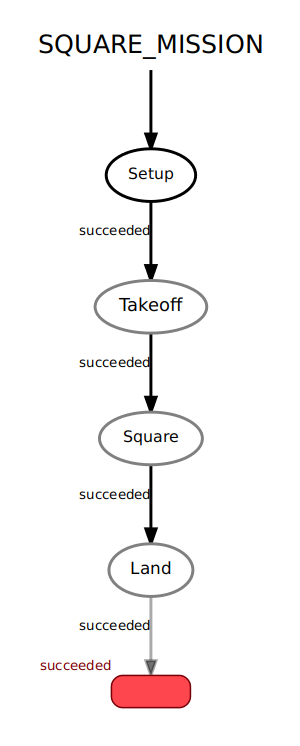

# Aula 7 - Máquinas de Estados em ROS

Máquinas de estados são modelos que representam um sistema através de um conjunto de estados e das transições entre eles. Elas são frequentemente utilziadas em sistemas digitais e em programação.

## 1. Por que Máquinas de Estado?

No controle de sistemas embarcados, é útil ter alguma forma de representar o estado atual do sistema, e formas de garantir que a mudança de comportamento (logo, de estado) do sistema ocorre segundo regras bem definidas. Utilizar máquinas de estado é, portanto, uma metodologia útil para sistematizar o desenvolvimento.

Vamos utilizar máquinas de estado para controlar a **missão do drone**, isto é, comandos de alto nível como *decolar*, *percorrer a trajetória*, e *pousar*. Como veremos, o ROS possui uma ferramenta para programar máquinas de estados que facilita o desenvolvimento e a visualização de missões mais complexas.

## 2. O pacote SMACH

O pacote [`smach`](http://wiki.ros.org/smach) é uma biblioteca para Python que permite a construção de máquinas de estado no ROS. 

- Cada **estado (State)**, quando ativo, representa algum comportamento do sistema, o que significa que ele executa uma função realizando alguma tarefa. 
- Ao final dessa função, é dada uma saida, chamada ***outcome***. Cada *outcome* então codifica uma transição entre estados. 

A partir de um estado inicial, o `smach` executa as tarefas de cada estado ativo, segue as transições para ativar novos estados, e então repete o processo.

## 3. Exemplo: Quadrado com drone

Vamos implementar uma missão simples usando drones: queremos que ele decole, faça uma trajetória quadrada de 5m de lado, e então pouse. Já fizemos esse exercício na 4ª aula sem usar máquinas de estado, porém, isso servirá para visualizar a metodologia e exemplificar como funciona o `smach`.

O código está disponível no arquivo `mav_control/scripts/square_sm.py`, e implementa o diagrama abaixo:



```python
#!/usr/bin/python
# -*- coding:utf-8 -*-

import rospy
import smach
import smach_ros
from geometry_msgs.msg import PoseStamped
from mavros_msgs.srv import SetMode, CommandBool
from mavros_msgs.msg import State


TOL = 0.1

rospy.init_node("takeoff_land")

# Objetos de comandos e estados
current_state = State()
current_pose = PoseStamped()
goal_pose = PoseStamped()

# Funções de callback
def state_callback(msg):
    global current_state
    current_state = msg

def pose_callback(msg):
    global current_pose
    current_pose = msg

# Objetos de Service, Publisher e Subscriber
arm = rospy.ServiceProxy('/mavros/cmd/arming', CommandBool)
set_mode_srv = rospy.ServiceProxy('/mavros/set_mode', SetMode)
local_position_pub = rospy.Publisher('/mavros/setpoint_position/local', PoseStamped, queue_size=10)
state_sub = rospy.Subscriber("/mavros/state", State, state_callback)
pose_sub = rospy.Subscriber("/mavros/local_position/pose", PoseStamped, pose_callback)

# Frequência de publicação do setpoint
rate = rospy.Rate(20)
```

Esse trecho inicial é idêntico aos das últimas aulas. Nele, importamos as bibliotecas utilizadas, criamos o node ROS e os Publishers e Subscribers para os tópicos a serem utilizados.