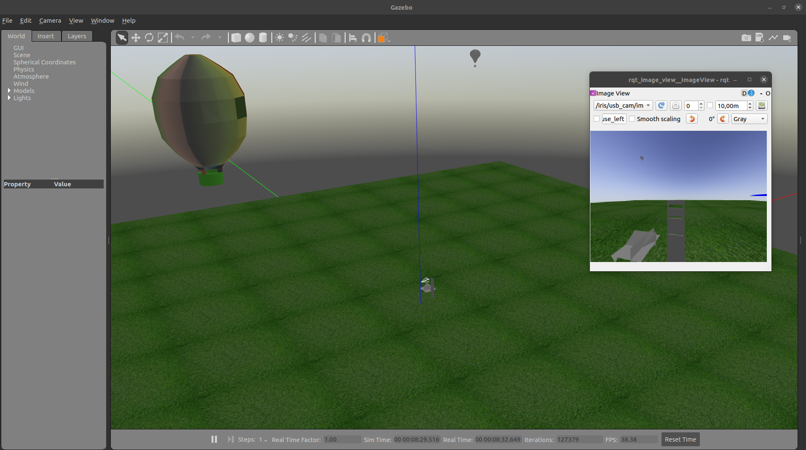
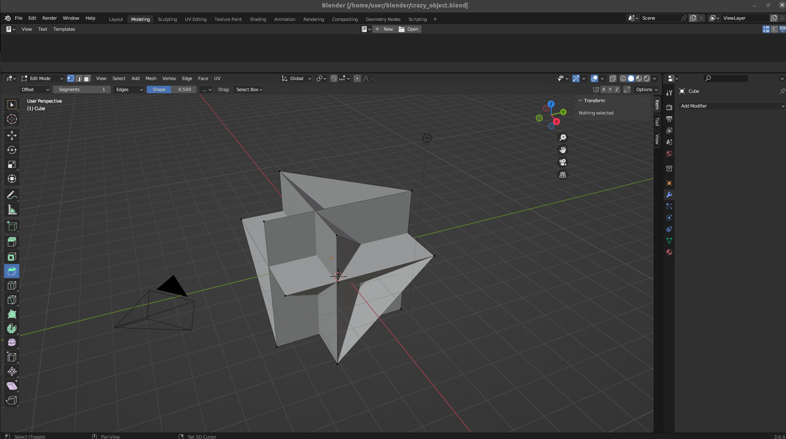
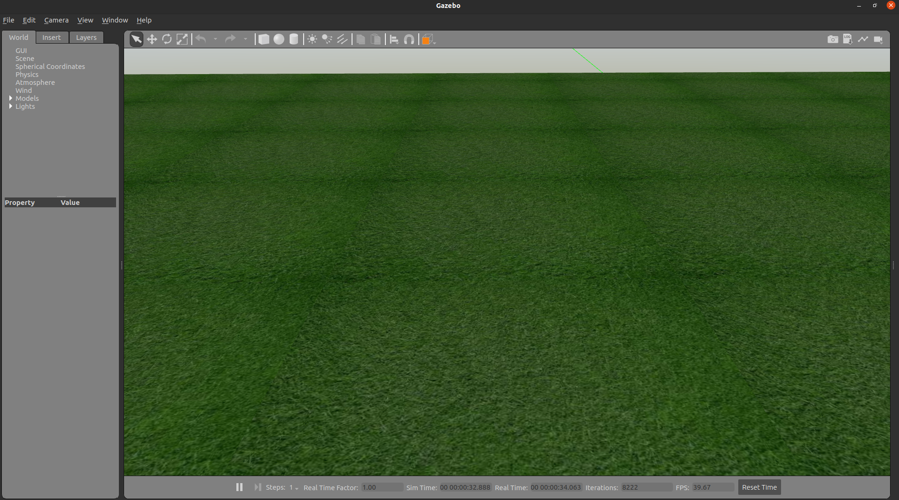
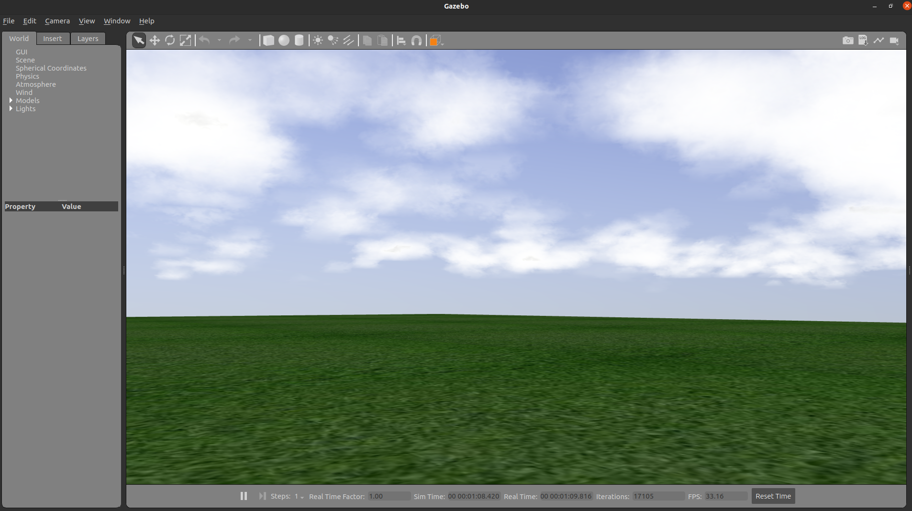
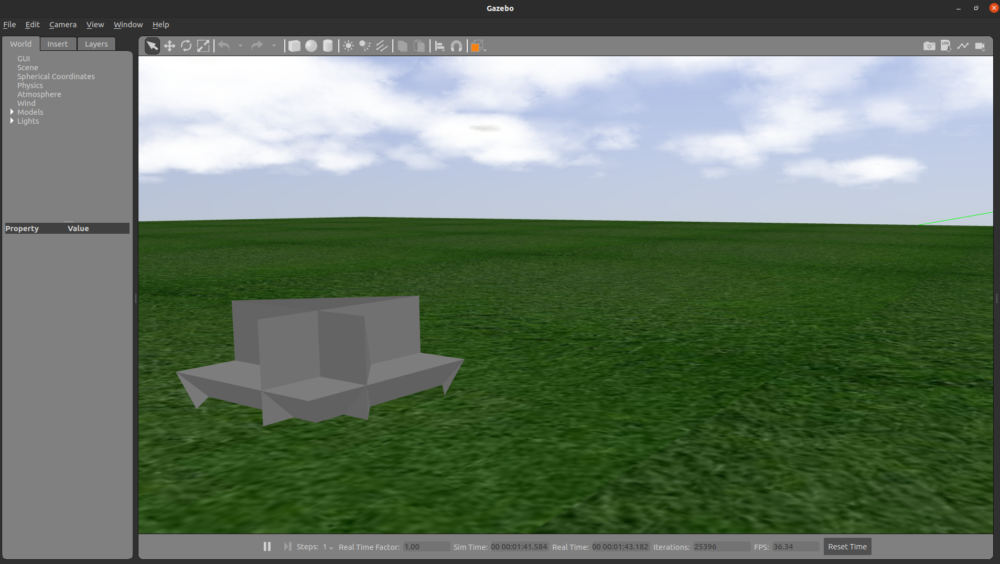
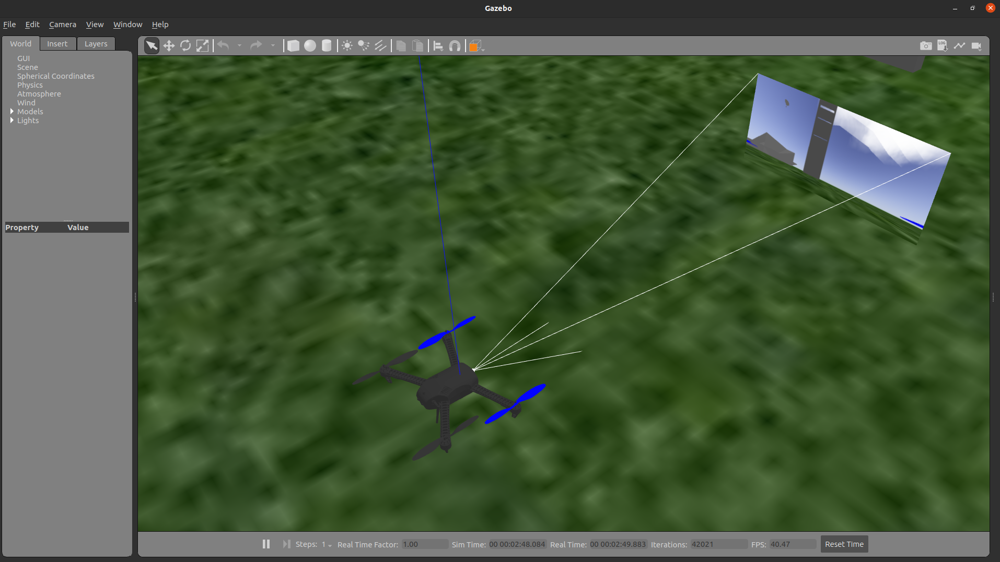
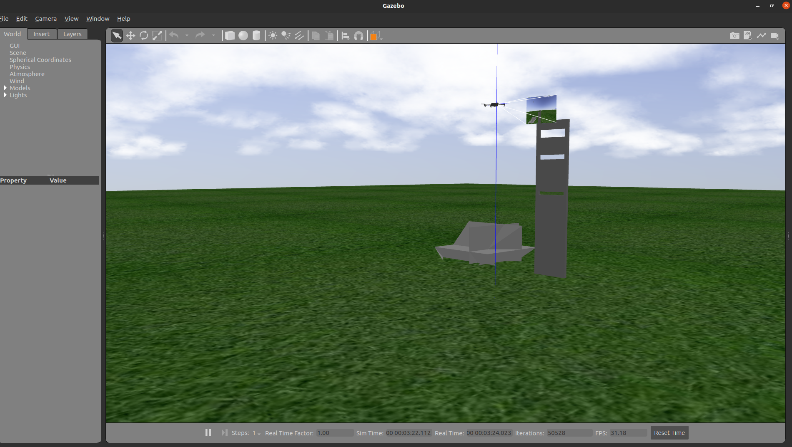

# Simulação Software in the Looop de um drone IRIS com Firware PX4, MAVROS/MAVLINK e Gazebo

A documentação a seguir Explica em detalhes como criar e customizar simulações SITL (Software in the loop) usando o PX4, MAVROS/MAVLINK e Gazebo.

Para os tutoriais a seguir, alguns conhecimentos são necessários e podem ser encontrados nos seguintes links. Consulte-os quando necessário. Recomendamos tentar entender primeiro os tutoriais da skyrats e recorer a estes links quando necessário.

* SDF: Simulation Description File

[Documentação SDF](http://sdformat.org/tutorials?cat=specification&)

Aqui você poderá encontrar os significados de cada <tag> usada nesta linguagem de descrição de arquivos de simulação e entender o significado de argumentos e parâmetros configurados nos arquivos de simulação.

* Gazebo

[Tutorias gazebo](https://classic.gazebosim.org/tutorials)

Aqui você pode conferir os tutoriais oficiais do gazebo para te auxiliar no entendimento de algo que não tenha ficado claro nas explicações das seções deste tutorial.

* PX4
  
[Tutorial do firmware px4 de como rodar uma simulação autonoma](https://docs.px4.io/main/en/ros/mavros_offboard_python.html)

Aqui você pode conferir a documentação oficial da PX4 sobre como rodar uma simulação autonoma com dorne IRIS e o Gazebo.

## Parte 1 Entendendo o Gazebo


No link a seguir você terá a oportunidade de aprender sobre o Gazebo. Observação: Arquivos mencionados no tutorial encontram-se nesse mesmo link do github.

[Siga para o tutorial Skyrats sobre Gazebo](https://github.com/SkyRats/psi3442/tree/master/5a_Aula)

## Parte 2 Utilizando Sensores (LiDAR e Câmera)

No link a seguir você terá a oportunidade de aprender sobre o Sensores simulados no Gazebo. Observação: Arquivos mencionados no tutorial encontram-se nesse mesmo link do github.

[Siga para o tutorial Skyrats sobre Sensores](https://github.com/SkyRats/psi3442/tree/master/6a_Aula/scripts)

## Parte 3 Customizando tudo

Nesta terceira parte do tutorial você terá a oportunidade de aprender a criar o pacote iris_sim que utilizará modelos customizados por você salvos no diretório ~/.gazebo/models feitos no Blender para criar as simulações mais incríveis com drones!

Na aula de hoje veremos como criar um mundo gramado, com um lindo céu com nuvens brancas, alguns objetos de cena em um dia ensolarado e com dois balões incríveis.



Preste muito atenção a todos os detalhes das duas observações a seguir :warning: :warning: :warning:

Observação importante: O tutorial a seguir se propõe a explicar como criar os arquivos e organizá-los de forma correta para que a simulação funcione. Porém, os códigos dos objetos, modelos e mundos cirados não serão apresentados no texto. Fica a cargo do leitor conferir o diretório .gazebo/models e o rospackge iris_sim (ambos fornecidos nesse turorial) e procurar os arquivos mencionados neste tutorail para entender na prática o que é explicado neste texto.

Observação importante 2: Lembre-se de criar um ROS workspace (sugiro drone_ws) e adicionar o pacote iris_sim fornecido nesse tutorial ao seu workspace. Lembre-se ainda de adicionar no diretório home do seu computador a pasta models contida no diretório .gazebo/ deste tutorial. Alerta super importante. Não copie a pasta .gazebo na sua home pois isso apagará aquela que já existe e isso pode quebrar o funcionamento do seu gazebo.

### 3.1 Blender


O [Blender](https://www.blender.org/) é uma ferramenta de modelagem e desenho 3D fácil de usar e que lhe permitirá criar obejtos e cenários para sua simulação no gazebo.

Caso queria aprender mais sobre como desenhar no Blender recomendo o seguinte [tutorial](https://www.youtube.com/watch?v=UAami_DhnTA&list=PLC7nmYI-cbT1gLvOzU-pcIZKbPezbRSyz). Se preferir aprender a partir do zero mas com um exemplo mais completo confira este [vídeo](https://www.youtube.com/watch?v=YjyObVcdHZY) do mesmo canal.

Ok, sabendo desenhar o que você deseja no Blender, é hora de importar seu modelo para o Gazebo.

Para esse tutorial eu criei um objeto chamado crazy_object.blend (arquivo do blender) mostrado a seguir.

. Agora, para importar para o gazebo devemos gerar um objeto crazy_object.dae com essa nova extensão de arquivos. 

Para isto, basta exportar o projeto crazy_object no Blender escolhendo a opção .dae e pronto. Com o arquivo crazy_object.dae podemos criar um modelo no diretório ~/.gazebo/models/ chamado crazy_object. Este modelo poderá ser chamado no arquivo mundo_customizado.world

## 3.2 IRIS SIM! Um universo onde sou amigo do Rei!

O iris_sim é um rospackge criado com rospy (python) e roscpp (C++, opicional caso queria programar seus scripts já em C++ pensando em aplicá-los de maneira otimizada em sistemas embarcados). O objetivo desse pacote é fornecer um arquivo chamado simulation.launch capaz prover um ambiente de simulação com um mundo customizado e drone customizado integrado ao firmware PX4.

Após criar o pacote adequadamente com os comandos ensinados no tutorial de ROS, incluimos as seguintes pastas adicionais para criar noss maravilhos pacote de simulação. Se você quiser aprender mais, você pode criar o pacote do zero e ir montando ele copiando e alterando os arquivos do pacote original. Se você tem pressa, pode baixar o pacote direto e apenas alterar aquilo que faz sentido para você.

Dentro do packge iris_sim você verá, dentre outros diretórios os seguintes:

* launch : guarda o arquivo simulation.launch responsável por chamar o firmware PX4, iniciar o ROS e Mavros. E iniciar o drone IRIS customizado dentro de um mundo também customizado. Para mais detalhes entre no arquivo simulation.launch

* models: contém o arquivo iris_custom. Este arquivo é um modelo .sdf customizável de um drone IRIS padrão que é instanciado e customizado por meio de modelos (sensores/atuadores) salvos no diretório ~/.gazebo/models

* scripts: contém os algoritimos de automação do drone. Você pode salvar seus scripts de automação em outro rospackge se preferir. Se por ventura achar mais conveniente salvar tudo junto, basta adicionar seu .py na pasta scripts.

* worlds: guarda o arquivo custom_world.world que descreve um mundo personalizável que uni modelos do diretório ~/.gazebo/models

## 3.3 Brilha sol! Ilumine meu mundo!

Aqui vamos entender o modelo sun_customized que está implementado no diretório ~/.gazebo/models. O modelo em si encontra-se no arquivo  ~/.gazebo/models/sun_customized/model.sdf

Define-se aqui uma fonte de luz perpendicular ao solo como sendo o sol do mundo outdoor do iris_sim. Para entender melhor as <tags> de iluminação leia [Parâmetros de iluminação em SDF](http://sdformat.org/tutorials?tut=spec_materials&cat=specification&)

Com isso, incluindo o modelo sun_customized no mundo custom_world.world o mundo passa a ser iluminado pelo sol com os parâmetros que você escolheu.

## 3.4 Um Belo Gramado

Aqui vamos entender o modelo grass_plane que está implementado no diretório ~/.gazebo/models. O modelo em si encontra-se no arquivo  ~/.gazebo/models/grass_plane/model.sdf



Define-se aqui o material e especificações do solo do mundo outdoor do iris_sim. Este modelo é muito similar ao asphalt_plane explicado na parte 1 deste tutorial. Basicamente o modelo conta com um arquivo model.sdf onde a descrição principal do modelo de piso gramado é feita. A pasta "materials" contém duas outas: "sccipts" e "textures".
A pasta "scripts" tem um arquivo chamado grass.material . Este arquivo define o material grama, a sua textura salva no formato .png e como a luz afeta este material. A pasta "textures" contém uma foto chamada grass.png conténdo uma visão aérea de um chão gramado quadrado.

Com isso, incluindo o modelo grass_plane no mundo custom_world.world o piso do mundo passa a ser um belo gramado verde.

## 3.5 O Céu Perfeito

Dentro de um mundo descrito por um arquivo .world é possível adicionar cenas padrão do Gazebo. A seguir, mostra-se o trecho de código do cutom_world.world que adiciona uma cena contendo um céu com nuvens que se movem com velocidade 12. Os demais parâmetros referem-se a iluminação.



```xml
<world name="default">
  <scene>
    <sky>
      <clouds>
        <speed>12</speed>
      </clouds>
    </sky>
    <ambient>0.95 0.95 0.95 1</ambient>
    <background>0.3 0.3 0.3 1</background>
    <shadows>true</shadows>
  </scene>
</world>
```

Com este cenário incluído, temos agora um ambiente inspirador e realista para simulações outdoor que envolvam visão computacional.

## 3.6 Adicionando um objeto inusitado

Aqui vamos entender o modelo crazy_obejtc definido na seção 3.1 e que está implementado no diretório ~/.gazebo/models. O modelo em si encontra-se no arquivo  ~/.gazebo/models/crazy_object/model.sdf



Adiciona-se o modelo no mundo custom_world.world . O objeto é definido no arquivo model.sdf que inclui o arquivo crazy_object.dae importado do Blender como explicado na seção 3.1. Esse arquivo fica no seguinte diretório: ~/.gazebo/models/crazy_object/meshes/crazy_object.dae

Mas, e se quisermos ir além e quisermos colocar um balão colorido na simulação?

o processo é o mesmo. Observe os arquivos do modelo happy_baloon no diretório ~/.gazebo/models/happy_baloon . Observe que agora uma textura foi adicionada ao balao2.dae . Tanto o arquivo exportado do Blender contendo o balão "balao2.dae" quanto a textura usada no blander "ImphenziaPalette01.png" devem estar no diretório ~/.gazebo/models/happy_baloon/meshes para que o balão apareça colorido no mundo do pacote iris_sim. Lembre-se de posicionar o balão com uma altura coerente no arquivo .world para que ele aparente estar voando. 

Com isso, agora completa-se a explicação de como é possível incluir objetos do Blender no Gazebo. Note que no arquivo model.sdf é possível definir propriedades físicas do objeto importado do Blender como massa, momentos de inércia, magnetismo e etc.

## 3.7 o drone que eu sempre quis!

É hora de adicionarmos um drone IRIS que possa ser customizado em nossa simulação do pacote iris_sim. Para isso, no diretório iris_sim/models cria-se uma pasta chamada iris_custom. Está pasta conta com um model.sdf que define um drone IRIS padrão (advindo do modelo padrão do firmware PX4). E além disso, esse arquivo inclui sensores como uma câmera chamda custom_cam e define uma joint, isto é, como a câmera é acoplada no drone. O iris é o link pai no qual um link filho, a câmera, é acoplada.



Os sensore inclusos são deifinidos como modelos no diretório ~/.gazebo/models . A câmera supracitada por exemplo é um modelo descrito em ~/.gazebo/models/cam_custom .

Assim, é possível criar no gazebo um gêmio digital de um drone multirrotor com diferentes sensores para diversas aplicações possíveis de drones. Com essa estrutura, você pode testar em simulação o drone mais legal que você possa imaginar. Repleto de sensores e tecnologias interessantes mesmo sem dispor do hardware necessário para os testes no momento. Falando sério, é assim que se testa diversas configurações de sensores para um drone antes de montar um protótipo e testar o drone para o Operational Design Domain especificado para ele.

## 3.8 Vendo o mundo de cima! A melhor câmera de todas!

Aqui vamos entender o modelo cam_custom que está implementado no diretório ~/.gazebo/models. O modelo em si encontra-se no arquivo  ~/.gazebo/models/cam_custom/model.sdf

Define-se aqui uma câmera customizada cujos parâmetros de tamanho de imagem, fov (field of view) e muito mais podem ser customizados para replicar o comportamento real de uma câmera de mercado que você planjea comprar e instalar no seu drone real.

Com isso, incluindo o modelo cam_custom no model.sdf do drone iris_custom o drone projetado agora pode utilizar recursos de visão computacional para realizar missões autonomas.

## 3.9 Um poder de semi-deus. Roslaunch, big-bang! Faça-se a luz! É hora de iniciar minha criação!

Arquivos com a extensão .launch são arquivos que servem para rodar multiplos scritpts e programas do ROS de modo que rodando tudo ao mesmo tempo seja possível executar uma simulação completa e realista de um sistema incluindo o sistema em si e uma ambientação padrão representativa do seu ODD (Operational Design Domain).

o arquivo simulation.launch do rospackge iris_sim realiza essa funcionalidade. 

O arquivo é auto explicativo, mas basicamente ele executa a simulação sitl do firmware PX4 usando a MAVROS. Em seguida, define-se o veículo como um drone iris e o modelo iris_custom é instanciado de forma a definir todas as características do veículo selecionado. Por fim, define-se o custom_world.world como mundo do gazebo a ser utilizado na simulação. 

Pronto, a executar esse comando um mundo completamente customizado com um drone personalizado estará disponível para qualquer script de missão que você deseje simular, salvo no diretório iris_sim/scirpts ou em outro rospackge à sua escolha.

# Parte 4 Rodando a simulação

É hora de exercutar sua primeira simulação com o pacote irsi_sim



## 4.1 Configurando bashrc

Certifique-se de ter as seguintes linahs de código em seu arquivo bashrc

A primeira linha define o ros noetic como o que estou utilizando no momento (sua versão de ROS pode ser diferente conforme sua versão de ubuntu. Consulte a sua [versão do ROS](http://wiki.ros.org/Distributions) em que o ano de lançamento é o ano da sua versão de ubuntu.

A segunda linha realiza o comando source no arquivo de setup do gazebo.

A terceira linha define drone_ws como o workspace padrão para a utilização do ROS no momento pois foi nesse workspace que eu salvei o rospakge iris_sim.

```
source /opt/ros/noetic/setup.bash
source /usr/share/gazebo/setup.sh
source ~/ros_workspaces/drone_ws/devel/setup.bash
```

Lembrando que para altera o bashrc basta abrir um terminal e usar

```
nano ~/.bashrc
```

## 4.2 Executando a simulação

Abra um terminal e execute 

```
roslaunch iris_sim simulation.launch 
```

Para rodar uma simulação simples de teste execute em um segundo terminal:

```
rosrun iris_sim takeoff_land.py
```

Observação: Se tudo der certo você deve ver algo no seu terminal parecido com isso:

Ao rodar o comando roslaunch

```bash
user@drone:~$ roslaunch iris_sim simulation.launch 
... logging to /home/user/.ros/log/5f69a850-6223-11ee-8479-59759678c935/roslaunch-drone-19392.log
Checking log directory for disk usage. This may take a while.
Press Ctrl-C to interrupt
Done checking log file disk usage. Usage is <1GB.

WARNING: Package name "turtle_controllers_A2B" does not follow the naming conventions. It should start with a lower case letter and only contain lower case letters, digits, underscores, and dashes.
started roslaunch server http://drone:35073/

SUMMARY
========

CLEAR PARAMETERS
 * /mavros/

PARAMETERS
 * /gazebo/enable_ros_network: True
 * /mavros/cmd/use_comp_id_system_control: False
 * /mavros/conn/heartbeat_rate: 1.0
 * /mavros/conn/system_time_rate: 1.0
 * /mavros/conn/timeout: 10.0
 * /mavros/conn/timesync_rate: 10.0
 * /mavros/distance_sensor/hrlv_ez4_pub/field_of_view: 0.0
 * /mavros/distance_sensor/hrlv_ez4_pub/frame_id: hrlv_ez4_sonar
 * /mavros/distance_sensor/hrlv_ez4_pub/id: 0
 * /mavros/distance_sensor/hrlv_ez4_pub/orientation: PITCH_270
 * /mavros/distance_sensor/hrlv_ez4_pub/send_tf: True
 * /mavros/distance_sensor/hrlv_ez4_pub/sensor_position/x: 0.0
 * /mavros/distance_sensor/hrlv_ez4_pub/sensor_position/y: 0.0
 * /mavros/distance_sensor/hrlv_ez4_pub/sensor_position/z: -0.1
 * /mavros/distance_sensor/laser_1_sub/id: 3
 * /mavros/distance_sensor/laser_1_sub/orientation: PITCH_270
 * /mavros/distance_sensor/laser_1_sub/subscriber: True
 * /mavros/distance_sensor/lidarlite_pub/field_of_view: 0.0
 * /mavros/distance_sensor/lidarlite_pub/frame_id: lidarlite_laser
 * /mavros/distance_sensor/lidarlite_pub/id: 1
 * /mavros/distance_sensor/lidarlite_pub/orientation: PITCH_270
 * /mavros/distance_sensor/lidarlite_pub/send_tf: True
 * /mavros/distance_sensor/lidarlite_pub/sensor_position/x: 0.0
 * /mavros/distance_sensor/lidarlite_pub/sensor_position/y: 0.0
 * /mavros/distance_sensor/lidarlite_pub/sensor_position/z: -0.1
 * /mavros/distance_sensor/sonar_1_sub/id: 2
 * /mavros/distance_sensor/sonar_1_sub/orientation: PITCH_270
 * /mavros/distance_sensor/sonar_1_sub/subscriber: True
 * /mavros/fake_gps/eph: 2.0
 * /mavros/fake_gps/epv: 2.0
 * /mavros/fake_gps/fix_type: 3
 * /mavros/fake_gps/geo_origin/alt: 408.0
 * /mavros/fake_gps/geo_origin/lat: 47.3667
 * /mavros/fake_gps/geo_origin/lon: 8.55
 * /mavros/fake_gps/gps_rate: 5.0
 * /mavros/fake_gps/mocap_transform: True
 * /mavros/fake_gps/satellites_visible: 5
 * /mavros/fake_gps/tf/child_frame_id: fix
 * /mavros/fake_gps/tf/frame_id: map
 * /mavros/fake_gps/tf/listen: False
 * /mavros/fake_gps/tf/rate_limit: 10.0
 * /mavros/fake_gps/tf/send: False
 * /mavros/fake_gps/use_mocap: True
 * /mavros/fake_gps/use_vision: False
 * /mavros/fcu_protocol: v2.0
 * /mavros/fcu_url: udp://:14540@loca...
 * /mavros/gcs_url: 
 * /mavros/global_position/child_frame_id: base_link
 * /mavros/global_position/frame_id: map
 * /mavros/global_position/gps_uere: 1.0
 * /mavros/global_position/rot_covariance: 99999.0
 * /mavros/global_position/tf/child_frame_id: base_link
 * /mavros/global_position/tf/frame_id: map
 * /mavros/global_position/tf/global_frame_id: earth
 * /mavros/global_position/tf/send: False
 * /mavros/global_position/use_relative_alt: True
 * /mavros/image/frame_id: px4flow
 * /mavros/imu/angular_velocity_stdev: 0.0003490659 // 0...
 * /mavros/imu/frame_id: base_link
 * /mavros/imu/linear_acceleration_stdev: 0.0003
 * /mavros/imu/magnetic_stdev: 0.0
 * /mavros/imu/orientation_stdev: 1.0
 * /mavros/landing_target/camera/fov_x: 2.0071286398
 * /mavros/landing_target/camera/fov_y: 2.0071286398
 * /mavros/landing_target/image/height: 480
 * /mavros/landing_target/image/width: 640
 * /mavros/landing_target/land_target_type: VISION_FIDUCIAL
 * /mavros/landing_target/listen_lt: False
 * /mavros/landing_target/mav_frame: LOCAL_NED
 * /mavros/landing_target/target_size/x: 0.3
 * /mavros/landing_target/target_size/y: 0.3
 * /mavros/landing_target/tf/child_frame_id: camera_center
 * /mavros/landing_target/tf/frame_id: landing_target
 * /mavros/landing_target/tf/listen: False
 * /mavros/landing_target/tf/rate_limit: 10.0
 * /mavros/landing_target/tf/send: True
 * /mavros/local_position/frame_id: map
 * /mavros/local_position/tf/child_frame_id: base_link
 * /mavros/local_position/tf/frame_id: map
 * /mavros/local_position/tf/send: False
 * /mavros/local_position/tf/send_fcu: False
 * /mavros/mission/pull_after_gcs: True
 * /mavros/mocap/use_pose: True
 * /mavros/mocap/use_tf: False
 * /mavros/odometry/fcu/odom_child_id_des: base_link
 * /mavros/odometry/fcu/odom_parent_id_des: map
 * /mavros/plugin_blacklist: ['safety_area', '...
 * /mavros/plugin_whitelist: []
 * /mavros/px4flow/frame_id: px4flow
 * /mavros/px4flow/ranger_fov: 0.118682
 * /mavros/px4flow/ranger_max_range: 5.0
 * /mavros/px4flow/ranger_min_range: 0.3
 * /mavros/safety_area/p1/x: 1.0
 * /mavros/safety_area/p1/y: 1.0
 * /mavros/safety_area/p1/z: 1.0
 * /mavros/safety_area/p2/x: -1.0
 * /mavros/safety_area/p2/y: -1.0
 * /mavros/safety_area/p2/z: -1.0
 * /mavros/setpoint_accel/send_force: False
 * /mavros/setpoint_attitude/reverse_thrust: False
 * /mavros/setpoint_attitude/tf/child_frame_id: target_attitude
 * /mavros/setpoint_attitude/tf/frame_id: map
 * /mavros/setpoint_attitude/tf/listen: False
 * /mavros/setpoint_attitude/tf/rate_limit: 50.0
 * /mavros/setpoint_attitude/use_quaternion: False
 * /mavros/setpoint_position/mav_frame: LOCAL_NED
 * /mavros/setpoint_position/tf/child_frame_id: target_position
 * /mavros/setpoint_position/tf/frame_id: map
 * /mavros/setpoint_position/tf/listen: False
 * /mavros/setpoint_position/tf/rate_limit: 50.0
 * /mavros/setpoint_raw/thrust_scaling: 1.0
 * /mavros/setpoint_velocity/mav_frame: LOCAL_NED
 * /mavros/startup_px4_usb_quirk: True
 * /mavros/sys/disable_diag: False
 * /mavros/sys/min_voltage: 10.0
 * /mavros/target_component_id: 1
 * /mavros/target_system_id: 1
 * /mavros/tdr_radio/low_rssi: 40
 * /mavros/time/time_ref_source: fcu
 * /mavros/time/timesync_avg_alpha: 0.6
 * /mavros/time/timesync_mode: MAVLINK
 * /mavros/vibration/frame_id: base_link
 * /mavros/vision_pose/tf/child_frame_id: vision_estimate
 * /mavros/vision_pose/tf/frame_id: odom
 * /mavros/vision_pose/tf/listen: False
 * /mavros/vision_pose/tf/rate_limit: 10.0
 * /mavros/vision_speed/listen_twist: True
 * /mavros/vision_speed/twist_cov: True
 * /mavros/wheel_odometry/child_frame_id: base_link
 * /mavros/wheel_odometry/count: 2
 * /mavros/wheel_odometry/frame_id: odom
 * /mavros/wheel_odometry/send_raw: True
 * /mavros/wheel_odometry/send_twist: False
 * /mavros/wheel_odometry/tf/child_frame_id: base_link
 * /mavros/wheel_odometry/tf/frame_id: odom
 * /mavros/wheel_odometry/tf/send: False
 * /mavros/wheel_odometry/use_rpm: False
 * /mavros/wheel_odometry/vel_error: 0.1
 * /mavros/wheel_odometry/wheel0/radius: 0.05
 * /mavros/wheel_odometry/wheel0/x: 0.0
 * /mavros/wheel_odometry/wheel0/y: -0.15
 * /mavros/wheel_odometry/wheel1/radius: 0.05
 * /mavros/wheel_odometry/wheel1/x: 0.0
 * /mavros/wheel_odometry/wheel1/y: 0.15
 * /rosdistro: noetic
 * /rosversion: 1.16.0
 * /use_sim_time: True

NODES
  /
    gazebo (gazebo_ros/gzserver)
    gazebo_gui (gazebo_ros/gzclient)
    mavros (mavros/mavros_node)
    sitl (px4/px4)
    vehicle_spawn_drone_19392_6990198150388307669 (gazebo_ros/spawn_model)

auto-starting new master
process[master]: started with pid [19411]
ROS_MASTER_URI=http://localhost:11311

setting /run_id to 5f69a850-6223-11ee-8479-59759678c935
WARNING: Package name "turtle_controllers_A2B" does not follow the naming conventions. It should start with a lower case letter and only contain lower case letters, digits, underscores, and dashes.
process[rosout-1]: started with pid [19432]
started core service [/rosout]
process[sitl-2]: started with pid [19440]
INFO  [px4] Creating symlink /home/user/skyrats_ws/src/skyrats-workplace/ros_packages/px4_firmware/ROMFS/px4fmu_common -> /home/user/.ros/etc

______  __   __    ___ 
| ___ \ \ \ / /   /   |
| |_/ /  \ V /   / /| |
|  __/   /   \  / /_| |
| |     / /^\ \ \___  |
\_|     \/   \/     |_/

px4 starting.

INFO  [px4] Calling startup script: /bin/sh etc/init.d-posix/rcS 0
process[gazebo-3]: started with pid [19453]
INFO  [param] selected parameter default file eeprom/parameters_10016
process[gazebo_gui-4]: started with pid [19465]
[param] Loaded: eeprom/parameters_10016
process[vehicle_spawn_drone_19392_6990198150388307669-5]: started with pid [19476]
process[mavros-6]: started with pid [19483]
INFO  [dataman] Unknown restart, data manager file './dataman' size is 11798680 bytes
INFO  [simulator] Waiting for simulator to accept connection on TCP port 4560
WARNING: Package name "turtle_controllers_A2B" does not follow the naming conventions. It should start with a lower case letter and only contain lower case letters, digits, underscores, and dashes.
WARNING: Package name "turtle_controllers_A2B" does not follow the naming conventions. It should start with a lower case letter and only contain lower case letters, digits, underscores, and dashes.
[ INFO] [1696361456.756631311]: FCU URL: udp://:14540@localhost:14557
[ INFO] [1696361456.763153486]: udp0: Bind address: 0.0.0.0:14540
[ INFO] [1696361456.763356100]: udp0: Remote address: 127.0.0.1:14557
[ INFO] [1696361456.763944367]: GCS bridge disabled
[ INFO] [1696361456.788886551]: Plugin 3dr_radio loaded
[ INFO] [1696361456.791255544]: Plugin 3dr_radio initialized
[ INFO] [1696361456.791468688]: Plugin actuator_control loaded
[ INFO] [1696361456.798362150]: Plugin actuator_control initialized
[ INFO] [1696361456.809069046]: Plugin adsb loaded
[ INFO] [1696361456.813252377]: Plugin adsb initialized
[ INFO] [1696361456.813765600]: Plugin altitude loaded
[ INFO] [1696361456.815441180]: Plugin altitude initialized
[ INFO] [1696361456.815676632]: Plugin cam_imu_sync loaded
[ INFO] [1696361456.816585973]: Plugin cam_imu_sync initialized
[ INFO] [1696361456.816963307]: Plugin command loaded
[ INFO] [1696361456.826672458]: Plugin command initialized
[ INFO] [1696361456.827046194]: Plugin companion_process_status loaded
[ INFO] [1696361456.831006756]: Plugin companion_process_status initialized
[ INFO] [1696361456.831364863]: Plugin debug_value loaded
[ INFO] [1696361456.840627296]: Plugin debug_value initialized
[ INFO] [1696361456.840743406]: Plugin distance_sensor blacklisted
[ INFO] [1696361456.841015689]: Plugin fake_gps loaded
[ INFO] [1696361456.851660825]: Plugin fake_gps initialized
[ INFO] [1696361456.851826545]: Plugin ftp loaded
[ INFO] [1696361456.857682638]: Plugin ftp initialized
[ INFO] [1696361456.857820956]: Plugin global_position loaded
[ INFO] [1696361456.871945743]: Plugin global_position initialized
[ INFO] [1696361456.872094893]: Plugin gps_rtk loaded
[ INFO] [1696361456.874030644]: Plugin gps_rtk initialized
[ INFO] [1696361456.874185260]: Plugin hil loaded
[ INFO] [1696361456.883636856]: Plugin hil initialized
[ INFO] [1696361456.883807856]: Plugin home_position loaded
[ INFO] [1696361456.886623953]: Plugin home_position initialized
[ INFO] [1696361456.886807204]: Plugin imu loaded
WARNING: Package name "turtle_controllers_A2B" does not follow the naming conventions. It should start with a lower case letter and only contain lower case letters, digits, underscores, and dashes.
WARNING: Package name "turtle_controllers_A2B" does not follow the naming conventions. It should start with a lower case letter and only contain lower case letters, digits, underscores, and dashes.
[ INFO] [1696361456.892360292]: Plugin imu initialized
[ INFO] [1696361456.892562953]: Plugin landing_target loaded
[ INFO] [1696361456.902175234]: Plugin landing_target initialized
[ INFO] [1696361456.902477233]: Plugin local_position loaded
[ INFO] [1696361456.907656239]: Plugin local_position initialized
[ INFO] [1696361456.907850726]: Plugin log_transfer loaded
[ INFO] [1696361456.910704939]: Plugin log_transfer initialized
[ INFO] [1696361456.910836216]: Plugin manual_control loaded
[ INFO] [1696361456.913251846]: Plugin manual_control initialized
[ INFO] [1696361456.913392484]: Plugin mocap_pose_estimate loaded
[ INFO] [1696361456.916012413]: Plugin mocap_pose_estimate initialized
[ INFO] [1696361456.916129619]: Plugin mount_control loaded
[ INFO] [1696361456.919221986]: Plugin mount_control initialized
[ INFO] [1696361456.919346866]: Plugin obstacle_distance loaded
[ INFO] [1696361456.921844348]: Plugin obstacle_distance initialized
[ INFO] [1696361456.921961267]: Plugin odom loaded
[ INFO] [1696361456.925655096]: Plugin odom initialized
[ INFO] [1696361456.925886128]: Plugin onboard_computer_status loaded
[ INFO] [1696361456.927769401]: Plugin onboard_computer_status initialized
[ INFO] [1696361456.928147182]: Plugin param loaded
[ INFO] [1696361456.932162352]: Plugin param initialized
[ INFO] [1696361456.932320893]: Plugin px4flow loaded
[ INFO] [1696361456.939559116]: Plugin px4flow initialized
[ INFO] [1696361456.939594825]: Plugin rangefinder blacklisted
[ INFO] [1696361456.939789830]: Plugin rc_io loaded
[ INFO] [1696361456.942719763]: Plugin rc_io initialized
[ INFO] [1696361456.942750701]: Plugin safety_area blacklisted
[ INFO] [1696361456.942883282]: Plugin setpoint_accel loaded
[ INFO] [1696361456.945366638]: Plugin setpoint_accel initialized
[ INFO] [1696361456.945590868]: Plugin setpoint_attitude loaded
[ INFO] [1696361456.952653057]: Plugin setpoint_attitude initialized
[ INFO] [1696361456.952805264]: Plugin setpoint_position loaded
[ INFO] [1696361456.963830163]: Plugin setpoint_position initialized
[ INFO] [1696361456.963957013]: Plugin setpoint_raw loaded
[ INFO] [1696361456.970870317]: Plugin setpoint_raw initialized
[ INFO] [1696361456.971250143]: Plugin setpoint_trajectory loaded
[ INFO] [1696361456.975052469]: Plugin setpoint_trajectory initialized
[ INFO] [1696361456.975198547]: Plugin setpoint_velocity loaded
[ INFO] [1696361456.978942387]: Plugin setpoint_velocity initialized
[ INFO] [1696361456.979192813]: Plugin sys_status loaded
[ INFO] [1696361456.987299043]: Plugin sys_status initialized
[ INFO] [1696361456.987490041]: Plugin sys_time loaded
[ INFO] [1696361456.991835595]: TM: Timesync mode: MAVLINK
[ INFO] [1696361456.993704054]: Plugin sys_time initialized
[ INFO] [1696361456.993990634]: Plugin trajectory loaded
[ INFO] [1696361456.998830849]: Plugin trajectory initialized
[ INFO] [1696361456.999061658]: Plugin vfr_hud loaded
[ INFO] [1696361456.999535938]: Plugin vfr_hud initialized
[ INFO] [1696361456.999572156]: Plugin vibration blacklisted
[ INFO] [1696361456.999754445]: Plugin vision_pose_estimate loaded
[ INFO] [1696361457.004836937]: Plugin vision_pose_estimate initialized
[ INFO] [1696361457.005050818]: Plugin vision_speed_estimate loaded
[ INFO] [1696361457.007622573]: Plugin vision_speed_estimate initialized
[ INFO] [1696361457.007896962]: Plugin waypoint loaded
[ INFO] [1696361457.011444391]: Plugin waypoint initialized
[ INFO] [1696361457.011493144]: Plugin wheel_odometry blacklisted
[ INFO] [1696361457.011742746]: Plugin wind_estimation loaded
[ INFO] [1696361457.012284294]: Plugin wind_estimation initialized
[ INFO] [1696361457.012338450]: Autostarting mavlink via USB on PX4
[ INFO] [1696361457.012480789]: Built-in SIMD instructions: SSE, SSE2
[ INFO] [1696361457.012514474]: Built-in MAVLink package version: 2020.6.6
[ INFO] [1696361457.012559325]: Known MAVLink dialects: common ardupilotmega ASLUAV autoquad icarous matrixpilot paparazzi slugs standard uAvionix ualberta
[ INFO] [1696361457.012602359]: MAVROS started. MY ID 1.240, TARGET ID 1.1
[INFO] [1696361457.157724, 0.000000]: Loading model XML from file /home/user/ros_workspaces/drone_ws/src/iris_sim/models/iris_custom/model.sdf
[INFO] [1696361457.159070, 0.000000]: Waiting for service /gazebo/spawn_sdf_model
[ INFO] [1696361457.363243593]: Finished loading Gazebo ROS API Plugin.
[ INFO] [1696361457.364713505]: waitForService: Service [/gazebo_gui/set_physics_properties] has not been advertised, waiting...
[ INFO] [1696361457.369282913]: Finished loading Gazebo ROS API Plugin.
[ INFO] [1696361457.370242958]: waitForService: Service [/gazebo/set_physics_properties] has not been advertised, waiting...
[ INFO] [1696361458.207516329]: waitForService: Service [/gazebo/set_physics_properties] is now available.
[ INFO] [1696361458.227333290]: Physics dynamic reconfigure ready.
[INFO] [1696361458.364699, 0.000000]: Calling service /gazebo/spawn_sdf_model
Warning [parser.cc:833] XML Attribute[version] in element[sdf] not defined in SDF, ignoring.
Warning [parser.cc:833] XML Attribute[version] in element[sdf] not defined in SDF, ignoring.
[ INFO] [1696361459.065691462, 0.004000000]: Camera Plugin: The 'robotNamespace' param was empty
[ INFO] [1696361459.069984629, 0.004000000]: Camera Plugin (ns = iris)  <tf_prefix_>, set to ""
[INFO] [1696361459.091379, 0.004000]: Spawn status: SpawnModel: Successfully spawned entity
[ WARN] [1696361459.171322113, 0.004000000]: The <focal_length>[277.191356] you have provided for camera_ [camera] is inconsistent with specified image_width [320] and HFOV [2.094400].   Please double check to see that focal_length = width_ / (2.0 * tan(HFOV/2.0)), the explected focal_lengtth value is [92.375521], please update your camera_ model description accordingly.
INFO  [simulator] Simulator connected on TCP port 4560.
INFO  [commander] LED: open /dev/led0 failed (22)
INFO  [init] Mixer: etc/mixers/quad_w.main.mix on /dev/pwm_output0
INFO  [mavlink] mode: Normal, data rate: 4000000 B/s on udp port 18570 remote port 14550
INFO  [mavlink] mode: Onboard, data rate: 4000000 B/s on udp port 14580 remote port 14540
INFO  [mavlink] mode: Onboard, data rate: 4000 B/s on udp port 14280 remote port 14030
INFO  [logger] logger started (mode=all)
INFO  [logger] Start file log (type: full)
INFO  [logger] [logger] ./log/2023-10-03/19_30_59.ulg
INFO  [logger] Opened full log file: ./log/2023-10-03/19_30_59.ulg
INFO  [mavlink] MAVLink only on localhost (set param MAV_BROADCAST = 1 to enable network)
INFO  [px4] Startup script returned successfully
pxh> [ INFO] [1696361459.448192414, 0.208000000]: udp0: Remote address: 127.0.0.1:14580
[ INFO] [1696361459.450169090, 0.208000000]: IMU: High resolution IMU detected!
INFO  [mavlink] partner IP: 127.0.0.1
[vehicle_spawn_drone_19392_6990198150388307669-5] process has finished cleanly
log file: /home/user/.ros/log/5f69a850-6223-11ee-8479-59759678c935/vehicle_spawn_drone_19392_6990198150388307669-5*.log
INFO  [ecl/EKF] 792000: GPS checks passed
[ INFO] [1696361460.418492627, 1.168000000]: CON: Got HEARTBEAT, connected. FCU: PX4 Autopilot
[ INFO] [1696361460.419554789, 1.168000000]: IMU: High resolution IMU detected!
[ INFO] [1696361461.431181739, 2.176000000]: VER: 1.1: Capabilities         0x000000000000e4ef
[ INFO] [1696361461.431647324, 2.176000000]: VER: 1.1: Flight software:     010b0200 (a50b6c262d000000)
[ INFO] [1696361461.431841860, 2.176000000]: VER: 1.1: Middleware software: 010b0200 (a50b6c262d000000)
[ INFO] [1696361461.431975953, 2.176000000]: VER: 1.1: OS software:         050f00ff (0000000000000000)
[ INFO] [1696361461.432103849, 2.176000000]: VER: 1.1: Board hardware:      00000001
[ INFO] [1696361461.432236569, 2.176000000]: VER: 1.1: VID/PID:             0000:0000
[ INFO] [1696361461.432356951, 2.176000000]: VER: 1.1: UID:                 4954414c44494e4f
INFO  [ecl/EKF] 3120000: EKF aligned, (baro hgt, IMU buf: 18, OBS buf: 14)
INFO  [ecl/EKF] 3120000: reset position to last known position
INFO  [ecl/EKF] 3120000: reset velocity to zero
[ INFO] [1696361462.566096865, 3.312000000]: IMU: Attitude quaternion IMU detected!
INFO  [ecl/EKF] 5488000: reset position to GPS
INFO  [ecl/EKF] 5488000: reset velocity to GPS
INFO  [ecl/EKF] 5488000: starting GPS fusion
[ INFO] [1696361475.443869445, 16.172000000]: WP: mission received

```

ao rodar o comando rosrun

```bash
user@drone:~$ rosrun iris_sim takeoff_land.py 
[INFO] [1696361651.420703, 191.840000]: Esperando conexao com FCU
[INFO] [1696361656.506744, 196.912000]: Alterando para modo Offboard
[INFO] [1696361656.509118, 196.916000]: Drone em modo Offboard
[INFO] [1696361656.530667, 196.936000]: Armando o drone
[INFO] [1696361656.771821, 197.176000]: Drone armado
[INFO] [1696361656.779607, 197.184000]: Subindo
[INFO] [1696361663.959618, 204.340000]: Esperando
[INFO] [1696361668.977889, 209.340000]: Para frente
[INFO] [1696361673.595260, 213.940000]: Esperando
[INFO] [1696361678.665080, 218.992000]: Alterando para modo Land
[INFO] [1696361678.845026, 219.172000]: Drone em modo Land
[INFO] [1696361678.848706, 219.176000]: Pousando. Altura = 5.077676296234131 m
[INFO] [1696361679.308941, 219.632000]: Pousando. Altura = 4.8941755294799805 m
[INFO] [1696361679.806456, 220.132000]: Pousando. Altura = 4.394478797912598 m
[INFO] [1696361680.308738, 220.632000]: Pousando. Altura = 3.927182674407959 m
[INFO] [1696361680.810413, 221.132000]: Pousando. Altura = 3.480250120162964 m
[INFO] [1696361681.311142, 221.632000]: Pousando. Altura = 3.059359073638916 m
[INFO] [1696361681.811604, 222.132000]: Pousando. Altura = 2.6699531078338623 m
[INFO] [1696361682.314760, 222.632000]: Pousando. Altura = 2.291961431503296 m
[INFO] [1696361682.816611, 223.132000]: Pousando. Altura = 1.9293144941329956 m
[INFO] [1696361683.320154, 223.632000]: Pousando. Altura = 1.5789867639541626 m
[INFO] [1696361683.820430, 224.132000]: Pousando. Altura = 1.2352200746536255 m
[INFO] [1696361684.318843, 224.632000]: Pousando. Altura = 0.8876571655273438 m
[INFO] [1696361684.823138, 225.132000]: Pousando. Altura = 0.5381966233253479 m
[INFO] [1696361685.322489, 225.632000]: Pousando. Altura = 0.18710818886756897 m
[INFO] [1696361685.827901, 226.132000]: Pousando. Altura = -0.14180436730384827 m
[INFO] [1696361686.326664, 226.632000]: Pousando. Altura = -0.1418667733669281 m
[INFO] [1696361686.827015, 227.132000]: Pousando. Altura = -0.13751015067100525 m
[INFO] [1696361687.330563, 227.632000]: Pousado no solo. Altura = -0.13645322620868683 m
[INFO] [1696361687.830910, 228.132000]: Pousado no solo. Altura = -0.1404024064540863 m
[INFO] [1696361688.330842, 228.632000]: Pousado no solo. Altura = -0.1442662626504898 m
Pressione Ctrl+C para encerrar a simulacao

```
